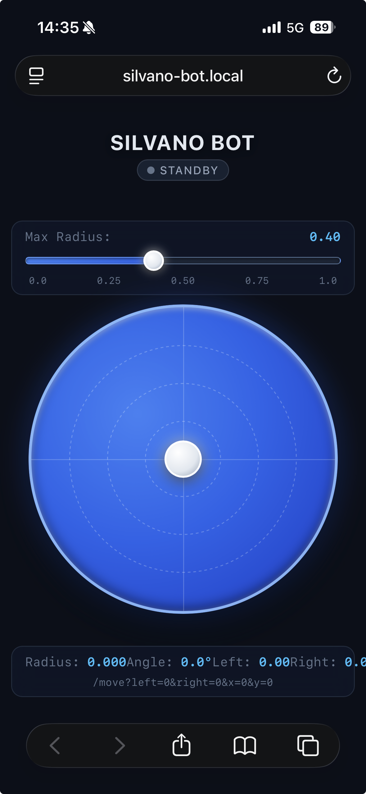
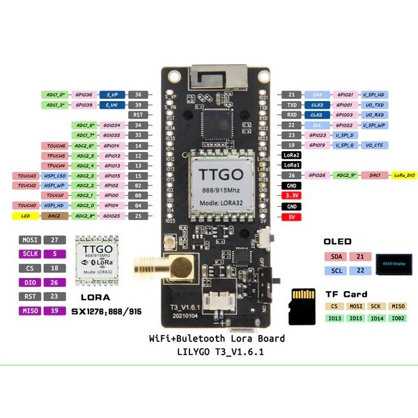

#+STARTUP: inlineimages
* Silvano Bot

Silvano-Bot is a small robotics platform to experiment with.

** Quickstart

 - Power on the robot.
 - Connect to the network =silvano-bot= with your smartphone.
 - After a few seconds, go to http://silvano-bot.local
 - Control the robot using your finger. Adjust the slider on the top
   for the maximum speed.

*** Issues on Android

I've seen problems connecting to the =silvano-bot.local=-Address on
Android. If that doesn't work, go to http://192.168.71.1/ .

** Hardware Notes

The robot is based on a ESP32 microcontroller (LilyGO ESP32 T3) with a
builtin SSD1306-based 128x64 black/white pixel OLED display.

As drive module we use a MD23 robotics kit. This takes about 12V
input, and offers a set of 5V/SDA/SCL/GND connectors. These are used
to connect and power the ESP32.

*Attention*: the ESP32 is a 3.3 volt system! The MD23 is 5 volt
based. The connection used is [[https://learn.adafruit.com/working-with-i2c-devices/overview][I2C bus]] which must be driven to the
respective voltages. So we can't directly connect. Because of this a
[[https://www.adafruit.com/product/1875][level shifter]] (different model, but same features) is used to convert.

** Software Notes

There is two sets of software that show how to work with the robot:

 - [[file:README.org][Rust ESP IDF based.]]
 - [[file:micropython-firmware/README.org][Micropython based.]]

The fully featured one is the one in Rust.

** LilyGO ESP32 T3 LoRa Dev Kit

The LilyGO ESP32 T3 LoRa Dev Kit is a breakout board with an ESP32,
USB-micro connector, a 433MHz LoRa module and a small 128x64 OLED
display.

The LoRa module is not used in this robot.

*** Pinout

*** Pin Assignment

We use two I2C buses, one for the OLED, and one for the MD23. These
are their pins.

|-----+-------------|
| Pin | Function    |
|-----+-------------|
|  13 | SDA MD23    |
|  14 | SCL MD23    |
|-----+-------------|
|  21 | SDA Display |
|  22 | SCL Display |
|-----+-------------|

** MD23 Robotics Kit

The MD23 robotics kit a a bundle of two motors with encoders and a
control PCB. See [[file:docs/m=][the documentation]] for a full description of the
features.

It accepts about *12V* as input voltage and provides a I2C + 5V/GND
connector array.

*Important*: the documentation doesn't state this clearly, but the
device only operates at *100KHz* I2C bus frequency! If you use the very
common 400KHz, you will observer random errors. Learned that the hard
way.
